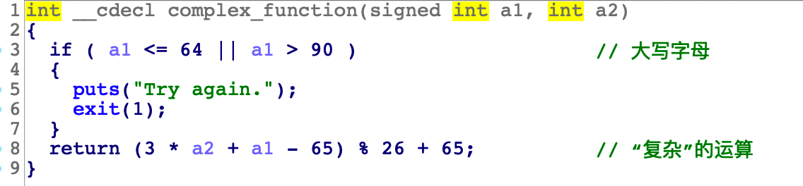

# 00_angr_find

## Information

- [src](https://github.com/jakespringer/angr_ctf)
- [image ref](https://bbs.kanxue.com/thread-264878.htm)

## Solution

### checksec 


### 分析

- 嘗試透過靜態分析觀察。

- 可以發現 `complex function`，輸出結果是根據其回傳結果進行判斷，若為 "JACEJGCS"，才會成功輸出 "Good Job."；否則會輸出 "Try again."。
    

- 分析 `complex function`，發現結果是根據特殊的複雜運算進行的。
    

### angr

- 嘗試透過 angr 對其進行分析，找出正確的輸入，進而獲取相對應的輸出結果。

- 紀錄 "Good Job." 位址。
    

- 載入 binary。
    ```py
    # load binary
    proj = angr.Project('./00_angr_find')
    ```

- 獲取 entry point。
    ```py
    # get entry point
    init_state = proj.factory.entry_state()
    ```

- 創建 simulation manager。
    ```py
    # create a simulation manager, and use init_state to initlize
    simgr = proj.factory.simgr(init_state)
    ```

- 使用 `explore()` 進行分析，尋找所有可能到達 `find_addr` 的路徑。
    ```py
    # we want to find the addr
    find_addr = 0x80492B0

    # explore() to explore until find the "find address"
    simgr.explore(find=find_addr)
    ```
### solve.py
```py
import angr

# load binary
proj = angr.Project('./00_angr_find')

# get entry point
init_state = proj.factory.entry_state()

# create a simulation manager, and use init_state to initlize
simgr = proj.factory.simgr(init_state)

# we want to find the addr
find_addr = 0x08048678 

# explore() to explore until find the "find address"
simgr.explore(find=find_addr)

# output result
if simgr.found:
    # get simulation manager 
    simulations = simgr.found[0]
    print(simulations)
    # output all stdin string
    print(simulations.posix.dumps(0))
else:
    print('no result')
```