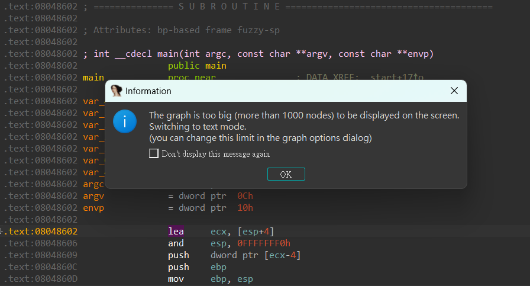

# 01_angr_avoid

## Information

- [src](https://github.com/jakespringer/angr_ctf)
- [img ref](https://bbs.kanxue.com/thread-264878.htm#msg_header_h2_2)

## Solution

### 查看程式相關資訊

 

### 分析

- 透過 IDA 分析，可以發現 main 函數過大，無法轉成 control flow graph。
    

- 透過字串引用可以發現 "Good Job." 、"Try Again." 等字串。
    

- 發現還有一個名為 `avoid_me` 的函數。
    - 可以發現函數作用是將 `should_succeed` 賦值為 0。
    

- 發現一另一個函數，名為 `maybe_good`。
    - 可以發現 jmp 條件是根據 `should_succeed` 是否為 0 來判斷 (`test al, al`)，若為 0 則跳至 "Try Again." 的 Block 中。
    

- 綜合以上條件，我們需要達成以下條件進行分析。
    - 防止進入 `avoid_me`。
    - 達成走訪至 `Good Job.`。

### solve.py
```py
import angr

# Load Binary
proj = angr.Project('./01_angr_avoid')

# get entry point
init_state = proj.factory.entry_state()

# create simulation manager, and use init_state(entry point) to initialize
simgr = proj.factory.simgr(init_state)

# avoid address & find address
avoid_addr = 0x080485A8
find_addr = 0x080485E0

# explore() to explore until find the "find address" and avoid the "avoid address"
simgr.explore(find=find_addr, avoid=avoid_addr)

# output result
if simgr.found:
    sim = simgr.found[0]
    print(sim.posix.dumps(0))
else:
    print("no result")
```


