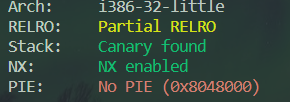

# 02_angr_find_condition

## Information

- [src](https://github.com/jakespringer/angr_ctf)
- [img ref](https://bbs.kanxue.com/thread-264878.htm#msg_header_h2_2)

## Solution

## 觀察程式相關資訊



## 分析

- binary 與前面差不多。
- 此題希望我們使用 function 的方式去判斷條件，進而提高重用性。

### solve.py
```py
import angr

def find_condition(state):
    stdout_output = state.posix.dumps(1)
    return b'Good Job.' in stdout_output

def avoid_condition(state):
    stdout_output = state.posix.dumps(1)
    return b'Try Again.' in stdout_output

def main():
    # load binary
    proj = angr.Project('./02_angr_find_condition')
    # get entry point
    init_state = proj.factory.entry_state()
    # create a simulation manager, and use init_state (entry point) to initialize
    simgr = proj.factory.simgr(init_state)

    # explore()
    # use find_condition to judge if it is in find condition
    # use avoid_condition to judge if it is in avoid condition
    simgr.explore(find=find_condition, avoid=avoid_condition)

    # output result
    if simgr.found:
        sim = simgr.found[0]
        print(sim.posix.dumps(0))
    else:
        print("no result")

if __name__=='__main__':
    main()
```