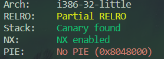
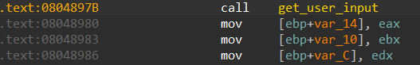

# 03_angr_symbolic_registers

## Information

- [src](https://github.com/jakespringer/angr_ctf)

## Solution

### 觀察程式相關資訊



### 分析

- 程式根據輸入的三個值進行判斷。

- 本題需要對初始狀態進行符號化。

- 初始位址自訂設為 `get_user_input()` 之後。
    
    
- 以上方圖可以得知，需將初始狀態中的 registers 進行符號化。

### angr

- `statr_address`指定初始位址 與 `blank_state()` 建立 `SimState` 物件，作為初始狀態使用。

- `claripy.BVS()` 建立 symbolic bitvector，用於之後注入值至初始狀態。

- 初始狀態。
    ```py
    # start_address will specify where the symbolic execution engine should begin.
    start_address = 0x08048980
    # use blank_state() to create a SimState object
    init_state = proj.factory.blank_state(addr=start_address)
    ```
- 創建 bitvector (the datatype Angr uses to inject symbolic value to binary)。
    ```py
    # Create a symbolic bitvector (the datatype Angr uses to inject symbolic
    # values into the binary.)
    password0_size_in_bits = 32 # :integer
    password0 = claripy.BVS('password0', password0_size_in_bits)

    password1_size_in_bits = 32 # :intger
    password1 = claripy.BVS('password1', password1_size_in_bits)

    password2_size_in_bits = 32 # :integer
    password2 = claripy.BVS('password2', password2_size_in_bits)
    ```

- 符號化 registers，設定自訂初始位址的值。
    ```py
    # set init registers
    init_state.regs.eax = password0
    init_state.regs.ebx = password1
    init_state.regs.edx = password2
    ```

- eval() 獲取其中一個解。
    ```py
    # Solve for the symbolic values. If there are multiple solutions, we only
    # care about one, so we can use eval, which returns any (but only one)
    # solution. Pass eval the bitvector you want to solve for.      
    solution0 = solution_state.solver.eval(password0)
    solution1 = solution_state.solver.eval(password1)
    solution2 = solution_state.solver.eval(password2)
    ```
    - 補充
        - `solver.eval(expression`將會解出一個可行解
        - `solver.eval_one(expression)`將會給出一個表達式的可行解，若有多個可行解，則拋出異常。
        - `solver.eval_upto(expression, n)`將會給出最多n個可行解，如果不足n個就給出所有的可行解。
        - `solver.eval_exact(expression, n)`將會給出n個可行解，如果解的個數不等於n個，將會拋出異常。
        - `solver.min(expression)`將會給出最小可行解
        - `solver.max(expression)`將會給出最大可行解

### solve.py
```py
import angr
import claripy
import sys

def find_condition(state):
    stdout_output = state.posix.dumps(sys.stdout.fileno())
    return b'Good Job.' in stdout_output

def avoid_condition(state):
    stdout_output = state.posix.dumps(sys.stdout.fileno())
    return b'Try Again.' in stdout_output

def main():
    # load binary
    proj = angr.Project('./03_angr_symbolic_registers')
    # get state
    # start_address will specify where the symbolic execution engine should begin.
    start_address = 0x08048980
    # use blank_state() to create a SimState object
    init_state = proj.factory.blank_state(addr=start_address)

    # Create a symbolic bitvector (the datatype Angr uses to inject symbolic
    # values into the binary.)
    password0_size_in_bits = 32 # :integer
    password0 = claripy.BVS('password0', password0_size_in_bits)

    password1_size_in_bits = 32 # :intger
    password1 = claripy.BVS('password1', password1_size_in_bits)

    password2_size_in_bits = 32 # :integer
    password2 = claripy.BVS('password2', password2_size_in_bits)
    #print(password0, password1, password2)

    # set init registers
    init_state.regs.eax = password0
    init_state.regs.ebx = password1
    init_state.regs.edx = password2

    # create a simulation manager
    simgr = proj.factory.simgr(init_state)

    # explore()
    simgr.explore(find=find_condition, avoid=avoid_condition)

    # output result
    if simgr.found:
        solution_state = simgr.found[0]
        # Solve for the symbolic values. If there are multiple solutions, we only
        # care about one, so we can use eval, which returns any (but only one)
        # solution. Pass eval the bitvector you want to solve for.      
        solution0 = solution_state.solver.eval(password0)
        solution1 = solution_state.solver.eval(password1)
        solution2 = solution_state.solver.eval(password2)
        
        #solution = ' '.join(map('{:x}'.format, [ solution0, solution1, solution2 ]))  # :string
        #print(solution)
        print(f'{solution0:x} {solution1:x} {solution2:x}')
    else:
        print('no result')

if __name__=='__main__':
    main()
```