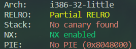
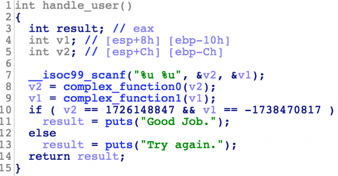

# 04_angr_symbolic_stack

## Information

- [src](https://github.com/jakespringer/angr_ctf)

## Solution

### 觀察程式相關資訊



### 分析

- 透過 IDA 進行分析。

- 注意到輸出完 `printf("Enter the password: ")` 會執行以下 `handle_user() ` 函數。
    - `handle_user()` 會先輸入兩個無號整數 (%u)，再分別根據 `complex_function` 的結果判斷。
    

- 特別注意到執行 `scanf()` 的 stack 分布。
    ```
        |  return address  |
        | -----------------|
        |     &format      |
        | -----------------|
        |     &ebp-ch      | -> password1
        | ---------------- | 
        |     &ebp-10h     | -> password0
        | ---------------- |
        |       ...        |
    ```

- 根據以上資訊，需要先將 stack 上的兩個輸入值進行符號化，才可以進行 angr 分析。

### angr

- `start_address`指定初始位址 並利用 `blank_state()` 建立 `SimState` 物件，作為初始狀態使用。

- `claripy.BVS()` 建立 symbolic bitvector，用於之後注入值至初始狀態(init_state)。

### solve.py
```py
import angr
import claripy
import sys

def find_condition(state):
    stdout_output = state.posix.dumps(sys.stdout.fileno())
    return b'Good Job.' in stdout_output

def avoid_condition(state):
    stdout_output = state.posix.dumps(sys.stdout.fileno())
    return b'Try Again.' in stdout_output

def main():
    # laod binary
    proj = angr.Project('./04_angr_symbolic_stack')
    # set start address
    start_address = 0x08048697
    # use blank_state() to create a SimState object
    init_state = proj.factory.blank_state(addr=start_address)

    # init state

    # create symbolic bitvector        
    password_size_in_bits = 32 # :integer
    password0 = claripy.BVS('password0', password_size_in_bits)
    password1 = claripy.BVS('password1', password_size_in_bits)

    # ebp to esp
    init_state.regs.ebp = init_state.regs.esp
  
    # padding
    padding_length_in_bytes = 8 # :integer
    init_state.regs.esp -= padding_length_in_bytes

    # push symbolic value (symbolic bitvector)
    init_state.stack_push(password0)
    init_state.stack_push(password1)

    # create a simulation manager
    simgr = proj.factory.simgr(init_state)

    # explore
    simgr.explore(find=find_condition, avoid=avoid_condition)

    # output result    
    if simgr.found:
        simulation = simgr.found[0]
        solution0 = simulation.solver.eval(password0)
        solution1 = simulation.solver.eval(password1)
        print(f'{solution0} {solution1}')
    else:
        print('no result')

if __name__=='__main__':
    main()
```