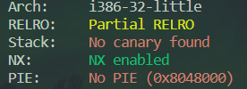
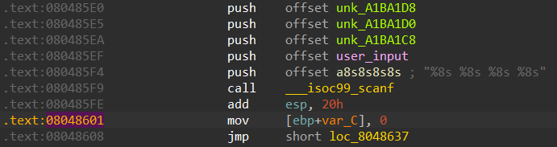
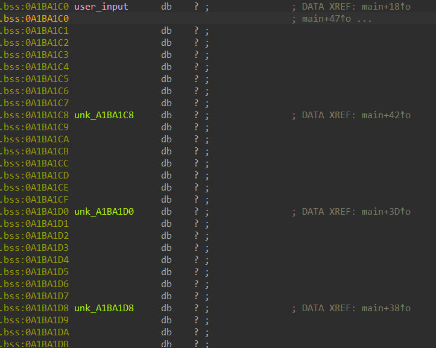

# 05_angr_symbolic_memory

## Information

- [src](https://github.com/jakespringer/angr_ctf)

## Solution

### 觀察程式相關資訊


### 分析

- 程式根據以下 format 進行輸入，再根據其進行判斷。
    ```
    "%8s %8s %8s %8s"
    ```

- 這裡需要將 bss 段存放變數的位址進行符號化。

- 將 start address 設為 `0x08048601`。
    

- 符號化目標為以下 bss 段位址。
    

### angr

- 透過 `state.memory.store(address, value)` 將值設為符號化。

- 長度皆為 8*8。

### solve.py
```py
import angr
import claripy
import sys

def find_condition(state):
    stdout_output = state.posix.dumps(sys.stdout.fileno())
    return b'Good Job.' in stdout_output

def avoid_condition(state):
    stdout_output = state.posix.dumps(sys.stdout.fileno())
    return b'Try Again.' in stdout_output

def main():
    # load binary
    proj = angr.Project('./05_angr_symbolic_memory')
    # set start address
    start_address = 0x08048601
    # get SimState object
    init_state = proj.factory.blank_state(addr=start_address)

    # init state

    # create symbolic bitvector  
    password0 = claripy.BVS('password0', 8*8)
    password1 = claripy.BVS('password1', 8*8)
    password2 = claripy.BVS('password2', 8*8)
    password3 = claripy.BVS('password3', 8*8)

    # init memory
    password0_address = 0x0A1BA1C0
    init_state.memory.store(password0_address, password0)
    password1_address = 0x0A1BA1C8
    init_state.memory.store(password1_address, password1)
    password2_address = 0x0A1BA1D0
    init_state.memory.store(password2_address, password2)
    password3_address = 0x0A1BA1D8
    init_state.memory.store(password3_address, password3)

    # create a simulation manager
    simgr = proj.factory.simgr(init_state)

    # explore
    simgr.explore(find=find_condition, avoid=avoid_condition)

    # output result
    if simgr.found:
        solution_state = simgr.found[0]
        solution0 = solution_state.solver.eval(password0,cast_to=bytes)
        solution1 = solution_state.solver.eval(password1,cast_to=bytes)
        solution2 = solution_state.solver.eval(password2,cast_to=bytes)
        solution3 = solution_state.solver.eval(password3,cast_to=bytes)
        solution = b' '.join([solution0, solution1, solution2, solution3 ])
        print(solution.decode('utf-8'))
    else:
        print('no result')

if __name__=='__main__':
    main()
```


