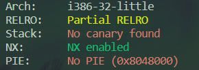
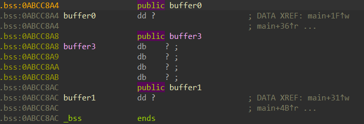

# 06_angr_symbolic_dynamic_memory

## Information

- [src](https://github.com/jakespringer/angr_ctf)

## Solution

### 觀察程式相關資訊



### 分析

- 程式執行過程會先 `malloc` 兩個 buffer，再將資料輸入至 buffer 中，最後根據其進行判斷。

- start address 設在 `scanf()` 輸入之後。
    

- 這裡需要將 `malloc` 的`buffer` 符號化。
    

### angr

- `cast_to`: 指定結果的資料型態。

- 符號化 heap buffer。
    ```py
    # create symbolic bitvector
    password0 = claripy.BVS('password0', 8*8)
    password1 = claripy.BVS('password1', 8*8)

    # create fake heap address
    fake_heap_address0 = 0xdeadbe00
    fake_heap_address1 = 0xdeadbf00
    
    # init memory 
    pointer_to_malloc_memory_address0 = 0x0ABCC8A4
    init_state.memory.store(pointer_to_malloc_memory_address0, fake_heap_address0, endness=proj.arch.memory_endness)
    pointer_to_malloc_memory_address1 = 0x0ABCC8AC
    init_state.memory.store(pointer_to_malloc_memory_address1, fake_heap_address1, endness=proj.arch.memory_endness)

    init_state.memory.store(fake_heap_address0, password0)
    init_state.memory.store(fake_heap_address1, password1)
    ```

### solve.py
- 注意需要先建一個 fake address 用於指定 `malloc` 後 heap buffer 的位址。
```py
import angr
import claripy
import sys

def find_condition(state):
    stdout_output = state.posix.dumps(sys.stdout.fileno())
    return b'Good Job.' in stdout_output

def avoid_condition(state):
    stdout_output = state.posix.dumps(sys.stdout.fileno())
    return b'Try Again.' in stdout_output

def main():
    # load binary
    proj = angr.Project('./06_angr_symbolic_dynamic_memory')
    # set start address
    start_address = 0x08048699
    # get SimState object
    init_state = proj.factory.blank_state(addr=start_address)

    # init state

    # create symbolic bitvector
    password0 = claripy.BVS('password0', 8*8)
    password1 = claripy.BVS('password1', 8*8)

    # create fake heap address
    fake_heap_address0 = 0xdeadbe00
    fake_heap_address1 = 0xdeadbf00

    # init memory 
    pointer_to_malloc_memory_address0 = 0x0ABCC8A4
    init_state.memory.store(pointer_to_malloc_memory_address0, fake_heap_address0, endness=proj.arch.memory_endness)
    pointer_to_malloc_memory_address1 = 0x0ABCC8AC
    init_state.memory.store(pointer_to_malloc_memory_address1, fake_heap_address1, endness=proj.arch.memory_endness)

    init_state.memory.store(fake_heap_address0, password0)
    init_state.memory.store(fake_heap_address1, password1)

    # create a simulation manager
    simgr = proj.factory.simgr(init_state)

    # explore
    simgr.explore(find=find_condition, avoid=avoid_condition)

    # output result
    if simgr.found:
        simulation = simgr.found[0]
        solution0 = simulation.solver.eval(password0, cast_to=bytes)
        solution1 = simulation.solver.eval(password1, cast_to=bytes)
        solution = b' '.join([solution0, solution1])
        print(solution.decode('utf-8'))
    else:
        print('no result')

if __name__=='__main__':
    main() 
```
