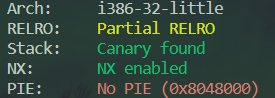
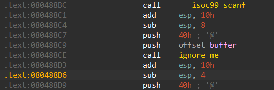

# 07_angr_symbolic_file

## Information

- [src](https://github.com/jakespringer/angr_ctf)

## Solution

### 觀察程式相關資訊



### 分析

- 程式輸入是從檔案獲取，所以需要將檔案符號化。

- start address 設為 `0x080488D6`。
    

### angr

- [SimFile](https://github.com/angr/angr-doc/blob/master/docs/file_system.md)
    ```py
    # create a SimFile object
    password = angr.storage.SimFile(filename, content='hello world!\n',size=len('hello world!\n'))
    # create a symbolic bitvector for SimFile
    symbolic_file_size_bytes = 64
    password = claripy.BVS('password', ymbolic_file_size_bytes * 8)
    # init state
    password_file = angr.storage.SimFile(filename, content=password, size=symbolic_file_size_bytes)
    ```

### *solve.py
- 尚有些許問題，輸出結果為 NULL(b'\x00\x00...')。
```py
import angr
import claripy
import sys

def find_condition(state):
    stdout_output = state.posix.dumps(sys.stdout.fileno())
    return b'Good Job.' in stdout_output

def avoid_condition(state):
    stdout_output = state.posix.dumps(sys.stdout.fileno())
    return b'Try Again.' in stdout_output

def main():
    # load binary
    proj = angr.Project('./07_angr_symbolic_file')
    # set start address
    start_addres = 0x080488D6
    
    file_name = 'file.txt'
    symbolic_file_size_bytes = 64
    # create symbolic bitvector
    password = claripy.BVS('password', symbolic_file_size_bytes*8)
    # simulate a file 
    password_file = angr.storage.SimFile(file_name, content=password, size=symbolic_file_size_bytes)
    
    # init state
    init_state = proj.factory.blank_state(addr=start_addres, fs={file_name:password_file})

    # create a simulation manager
    simgr = proj.factory.simgr(init_state)

    # explore
    simgr.explore(find=find_condition, avoid=avoid_condition)

    # output result
    if simgr.found:
        simulation = simgr.found[0]
        solution = simulation.solver.eval(password, cast_to=bytes)
        print(solution)
    else:
        print('no result')

if __name__=='__main__':
    main()
```