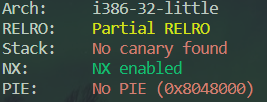

# 08_angr_constraints

## Information

- [src](https://github.com/jakespringer/angr_ctf)

## Solution

### 觀察程式相關資訊



### 分析

- 與前面都差不多，但是為了可以抓到正確的輸入，所以需要加條件進行判斷。

### angr

- add contraints
    ```py
    solution = simgr.found[0]
    # add constraints
    load_symbol = solution.memory.load(buffer_address, 16)
    solution.add_constraints(load_symbol==b'AUPDNNPROEZRJWKB')
    ```

### solve.py
```py
import angr
import claripy
import sys

def main():
    # load binary
    proj = angr.Project('./08_angr_constraints')
    # set start address
    start_address = 0x08048625
    # create a SimState object
    init_state = proj.factory.blank_state(addr=start_address)

    # create symbolic bitvector
    password = claripy.BVS('password', 16*8)
    
    # init state
    buffer_address = 0x0804A050
    init_state.memory.store(buffer_address, password)

    # checkpoints
    check_function_addr = 0x0804866C
    
    # create a simulation manager
    simgr = proj.factory.simgr(init_state)

    # explore
    simgr.explore(find=check_function_addr)

    # output result
    if simgr.found:
        solution = simgr.found[0]
        # add constraints
        load_symbol = solution.memory.load(buffer_address, 16)
        solution.add_constraints(load_symbol==b'AUPDNNPROEZRJWKB')
        
        flag = solution.solver.eval(password, cast_to=bytes)
        print(flag)
    else:
        print('no result')

if __name__=='__main__':
    main()
```