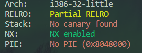
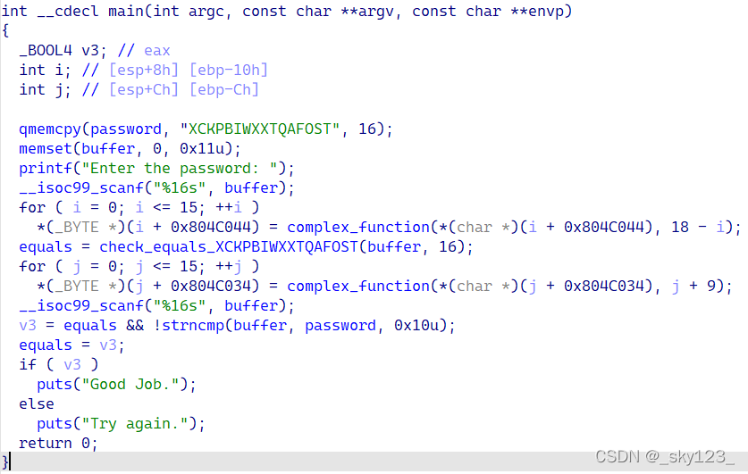
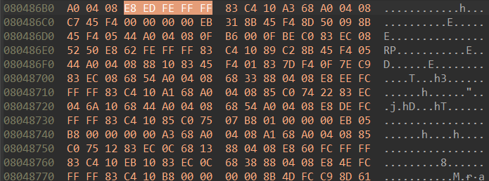

# 09_angr_hooks

## Information

- [src](https://github.com/jakespringer/angr_ctf)

- [image src](https://blog.csdn.net/qq_45323960/article/details/124392412)

## Solution

### 觀察程式相關資訊



### 分析

- 觀察程式執行內容，可以發現進行兩次輸入及兩次 `complex_fucntion()`。
    

- `check_equals_XYMKBKUHNIQYNQXE()`可能會造成 **Path Explode**，這裡通過 hooking 的方式來處理。

- `check_equals_XYMKBKUHNIQYNQXE()` bytes 長度 = 5。
    

- [hook, hooking](https://zh.wikipedia.org/zh-tw/%E9%92%A9%E5%AD%90%E7%BC%96%E7%A8%8B#:~:text=%E9%89%A4%E5%AD%90%E7%B7%A8%E7%A8%8B%EF%BC%88hooking%EF%BC%89%EF%BC%8C%E4%B9%9F,%E7%A8%B1%E7%82%BA%E9%89%A4%E5%AD%90%EF%BC%88hook%EF%BC%89%E3%80%82): 指通過攔截軟體模塊間的函數調用、消息傳遞、事件傳遞來修改或擴展作業系統、應用程式或其他軟體組件的行為的各種技術，處理被攔截的函數調用、事件、消息的代碼，被稱為鉤子（hook）。
    - 設計一個函數用於取代被 hook 的函數。

### angr

- hook
    ```py
    hook(addr, hook=None, length=0, kwargs=None, replace=False)proj.hook(address, length)
    ```
    ```py    
    # set check_equals address
    check_address = 0x080486B3

    # define hook
    skip_len = 5    # jmp 'length' if hooking is finish
    @proj.hook(check_address, length=skip_len)
    def skip_check(state):
        print('hooking!')
        buffer_addr = 0x0804A054
        load_buffer_symbol = state.memory.load(buffer_addr, 16)
        check_str = 'XYMKBKUHNIQYNQXE'
        # create a bitvector value
        state.regs.eax = claripy.If(
            load_buffer_symbol == check_str,
            claripy.BVV(1, 32),
            claripy.BVV(0, 32)
        )
    ```

### solve.py
```py
import angr
import claripy
import sys

def find_condition(state):
    stdout_output = state.posix.dumps(sys.stdout.fileno())
    return b'Good Job.' in stdout_output

def avoid_condition(state):
    stdout_output = state.posix.dumps(sys.stdout.fileno())
    return b'Try Again.' in stdout_output

def main():
    # load binary
    proj = angr.Project('./09_angr_hooks')

    # create a SimState object
    init_state = proj.factory.entry_state()

    # set check_equals address
    check_address = 0x080486B3

    # define hook
    skip_len = 5
    @proj.hook(check_address, length=skip_len)
    def skip_check(state):
        print('hooking!')
        buffer_addr = 0x0804A054
        load_buffer_symbol = state.memory.load(buffer_addr, 16)
        check_str = 'XYMKBKUHNIQYNQXE'
        # create a bitvector value
        state.regs.eax = claripy.If(
            load_buffer_symbol == check_str,
            claripy.BVV(1, 32),
            claripy.BVV(0, 32)
        )

    # create a simulation manager
    simgr = proj.factory.simgr(init_state)
        
    # explore
    simgr.explore(find=find_condition, avoid=avoid_condition)

    # output result
    if simgr.found:
        solution_state = simgr.found[0]
        flag = solution_state.posix.dumps(sys.stdin.fileno())
        print(flag)
    else:
        print('no result')

if __name__=='__main__':
    main()
```