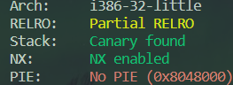

# 10_angr_simprocedures

## Information

- [src](https://github.com/jakespringer/angr_ctf)

- [image src](https://blog.csdn.net/qq_45323960/article/details/124392412)

## Solution

### 觀察程式相關資訊


### 分析

-  注意 Path Explode 問題。

- 因為原先被 hook 的目標被 call 太多次，因此前面一題的方式已經沒有效果。

### angr

- SimProcedures
    - 使用 SimProcedures 改變原先 Symbol 的行為。
    ```py
    # create a class for SimProcedure 
    class CheckEquals(angr.SimProcedure):
        def run(self, buffer_addr, length):
            buffer = self.state.memory.load(buffer_addr, length)
            return claripy.If(buffer == b'ORSDDWXHZURJRBDH', claripy.BVV(1, 32), claripy.BVV(0, 32))
        
    proj.hook_symbol(symbol_name='check_equals_ORSDDWXHZURJRBDH', simproc=CheckEquals())
    ```

### solve.py
```py
import angr
import claripy
import sys

def find_condition(state):
    stdout_output = state.posix.dumps(sys.stdout.fileno())
    return b'Good Job.' in stdout_output

def avoid_condition(state):
    stdout_output = state.posix.dumps(sys.stdout.fileno())
    return b'Try Again.' in stdout_output

def main():
    # load binary
    proj = angr.Project('./10_angr_simprocedures')

    # create a SimState object
    init_state = proj.factory.entry_state()

    # create a class for SimProcedure 
    class CheckEquals(angr.SimProcedure):
        def run(self, buffer_addr, length):
            buffer = self.state.memory.load(buffer_addr, length)
            return claripy.If(buffer == b'ORSDDWXHZURJRBDH', claripy.BVV(1, 32), claripy.BVV(0, 32))
        
    proj.hook_symbol(symbol_name='check_equals_ORSDDWXHZURJRBDH', simproc=CheckEquals())

    # create a simulation manager
    simgr = proj.factory.simgr(init_state)

    # explore
    simgr.explore(find=find_condition, avoid=avoid_condition)

    # output result
    if simgr.found:
        solution_state = simgr.found[0]
        flag = solution_state.posix.dumps(sys.stdin.fileno())
        print(flag)
    else:
        print('no result')

if __name__=='__main__':
    main()
```