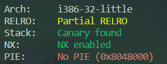

# 11_angr_sim_scanf

## Information

- [src](https://github.com/jakespringer/angr_ctf)


## Solution

### 觀察程式相關資訊


### 分析

- 注意 Path Explode 問題。

- 與上題比較，這裡改為 `scanf()`。

### angr

- SimProcedures
    - 使用 SimProcedures 改變原先 Symbol 的行為。
    ```py
    # create a class for SimProcedure
    class ReplaceScanf(angr.SimProcedure):
        def run(self, format, addr1, addr2):
            scan0 = claripy.BVS('scan0', 8*4)
            scan1 = claripy.BVS('scan1', 8*4)
            self.state.mem[addr1].uint32_t = scan0
            self.state.mem[addr2].uint32_t = scan1
            self.state.globals['solutions'] = (scan0, scan1)
    
    # set scanf symbol 
    scanf_symbol = '__isoc99_scanf'
    
    # set hook
    proj.hook_symbol(scanf_symbol, ReplaceScanf())
    ```

### solve.py
```py
import angr
import claripy
import sys

def find_condition(state):
    stdout_output = state.posix.dumps(sys.stdout.fileno())
    return b'Good Job.' in stdout_output

def avoid_condition(state):
    stdout_output = state.posix.dumps(sys.stdout.fileno())
    return b'Try Again.' in stdout_output

def main():
    # load binary
    proj = angr.Project('./11_angr_sim_scanf')
    
    # create a SimState object (entry point)
    init_state = proj.factory.entry_state()

    # create a class for SimProcedure
    class ReplaceScanf(angr.SimProcedure):
        def run(self, format, addr1, addr2):
            scan0 = claripy.BVS('scan0', 8*4)
            scan1 = claripy.BVS('scan1', 8*4)
            self.state.mem[addr1].uint32_t = scan0
            self.state.mem[addr2].uint32_t = scan1
            self.state.globals['solutions'] = (scan0, scan1)
    
    # set scanf symbol 
    scanf_symbol = '__isoc99_scanf'
    
    # set hook
    proj.hook_symbol(scanf_symbol, ReplaceScanf())

    # create a simulation manager
    simgr = proj.factory.simgr(init_state)
    
    # explore
    simgr.explore(find=find_condition, avoid=avoid_condition)

    # output result
    if simgr.found:
        solution = simgr.found[0]
        flag = solution.globals['solutions']
        print(f'{solution.solver.eval(flag[0])} {solution.solver.eval(flag[1])}')
    else:
        print('no result')

if __name__=='__main__':
    main()
```