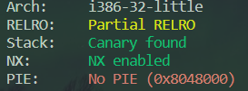

# 13_angr_static_binary

## Information

- [src](https://github.com/jakespringer/angr_ctf)


## Solution

### 觀察程式相關資訊



### 分析

- 與 00、01 相同，只是這裡是透過靜態連結 (static linking) 進行編譯。

### angr

- angr 本身可以擁有已經包好的部分 SimProcedures 可以使用。

- 透過已經包好的 SimProcedures 進行 hook 設定。
    ```py
    # set hook (use SIM_PROCEDURES written by angr)
    proj.hook_symbol('printf', angr.SIM_PROCEDURES['libc']['printf']())
    proj.hook_symbol('__isoc99_scanf', angr.SIM_PROCEDURES['libc']['scanf']())
    proj.hook_symbol('strcmp', angr.SIM_PROCEDURES['libc']['strcmp']())
    proj.hook_symbol('puts', angr.SIM_PROCEDURES['libc']['puts']())
    proj.hook_symbol('__libc_start_main', angr.SIM_PROCEDURES['glibc']['__libc_start_main']()) 
    ```

### solve.py
```py
import angr
import claripy
import sys

def find_condition(state):
    stdout_output = state.posix.dumps(sys.stdout.fileno())
    return b'Good Job.' in stdout_output

def avoid_condition(state):
    stdout_output = state.posix.dumps(sys.stdout.fileno())
    return b'Try Again.' in stdout_output

def main():
    # load binary 
    proj = angr.Project('./13_angr_static_binary')

    # create a SimState object (entry point)
    init_state = proj.factory.entry_state()

    # set hook (use SIM_PROCEDURES written by angr)
    proj.hook_symbol('printf', angr.SIM_PROCEDURES['libc']['printf']())
    proj.hook_symbol('__isoc99_scanf', angr.SIM_PROCEDURES['libc']['scanf']())
    proj.hook_symbol('strcmp', angr.SIM_PROCEDURES['libc']['strcmp']())
    proj.hook_symbol('puts', angr.SIM_PROCEDURES['libc']['puts']())
    proj.hook_symbol('__libc_start_main', angr.SIM_PROCEDURES['glibc']['__libc_start_main']())

    # create a simulation manager
    simgr = proj.factory.simgr(init_state)

    # explore
    simgr.explore(find=find_condition, avoid=avoid_condition)

    # output result
    if simgr.found:
        solution = simgr.found[0]
        flag = solution.posix.dumps(sys.stdin.fileno())
        print(flag)
    else:
        print('no result')
    
if __name__=='__main__':
    main()
```