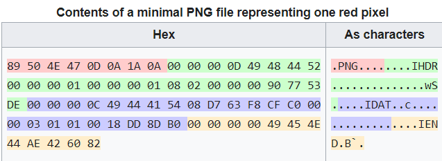

# C0rrupt

## Information

### Description

We found this file. Recover the flag.

### Hints

1. Try fixing the file header

## Solution

- [PNG](https://en.wikipedia.org/wiki/PNG): Portable Netword Graphics
    - contents
        
    - [List of signatures](https://en.wikipedia.org/wiki/List_of_file_signatures)

- [HxD](https://mh-nexus.de/en/hxd/): hex editor

### Step

- 題目給予的 PNG 檔是壞掉的，所以需要將其修復。

- 根據 PNG 檔的 critical chunks 作修正，滿足特徵條件。
    - PNG
    - IHDR
    - IDAT
    - IEND