# Easy Crack

## Information
---

- src: [reversing.kr](http://reversing.kr/challenge.php)

## Solution
---

### 嘗試執行檔案

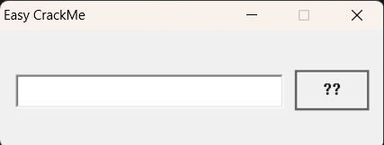

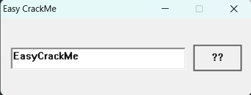

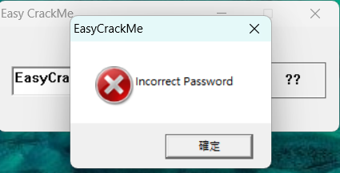
    
- 可以發現可能是用於輸入密碼的 MessageBox，根據輸入密碼進行檢查，再輸出是否正確。

### 觀察程式相關資訊
- [Exeinfo PE](https://exeinfo-pe.en.uptodown.com/windows): Exeinfo PE is a program that lets you verify .exe files and check out all their properties.
    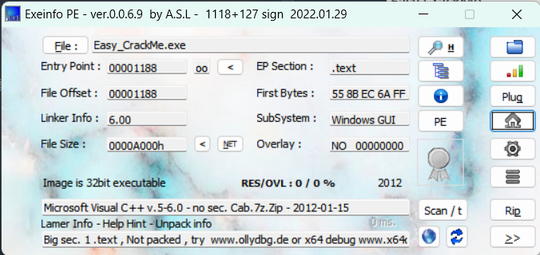

- 可以發現並未被加殼。

### 分析
- 嘗試靜態分析
    - [IDA pro](https://hex-rays.com/ida-pro/)
    - 進入 `WinMain` (從 `start` 往下追蹤 `WinMain`)
        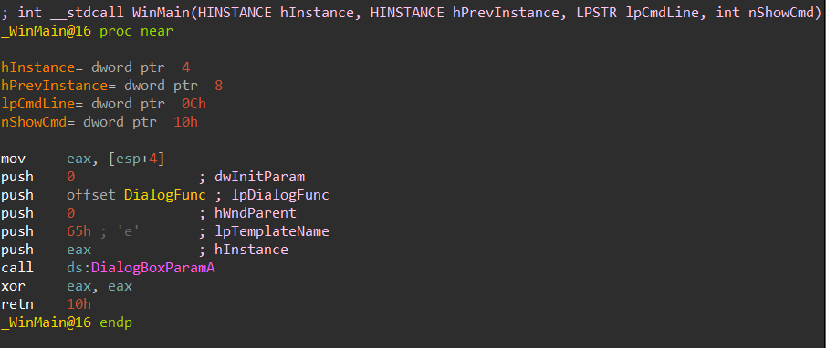
    
    - 可以發現 `WinMain` 一開始 push 一些資料進 `Stack` 中，再呼叫 `DialogBoxParamA()`。
        - [DialogBoxParamA function (winuser.h)](https://learn.microsoft.com/en-us/windows/win32/api/winuser/nf-winuser-dialogboxparama): Creates a modal dialog box from a dialog box template resource. Before displaying the dialog box, the function passes an application-defined value to the dialog box procedure as the lParam parameter of the WM_INITDIALOG message. An application can use this value to initialize dialog box controls.
        - 注意到第四個參數 `[in, optional] lpDialogFunc` 是一個指標指向 procedure (callback) 函式。
            ```cpp
            INT_PTR DialogBoxParamA(
                [in, optional] HINSTANCE hInstance,
                [in]           LPCSTR    lpTemplateName,
                [in, optional] HWND      hWndParent,
                [in, optional] DLGPROC   lpDialogFunc,
                [in]           LPARAM    dwInitParam
            );
            ```
    - 進入 `DialogBoxParamA()` -> 再進入 `sub_401080()`(此 function 才是真正執行的 function)。
    - 可以發現程式執行過程中透過 `GetItemTextA()` 取出輸入放置至 `String` 變數中，再判斷是否正確。
        ```cpp
        GetDlgItemTextA(hDlg, 0x3E8, String);
        ```

    - 第一次檢查
        
        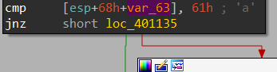 
        
        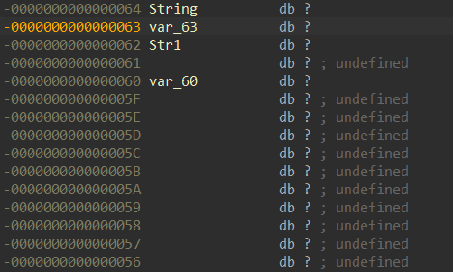

        - String 第二個 byte 要為 61h('a')

    - 第二次檢查

        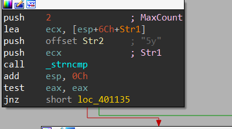
            
        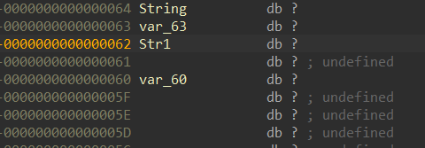

        - String 第三個 byte 後要 "5y"

    - 第三次檢查

        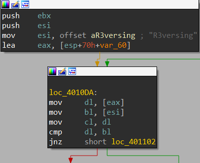
            
        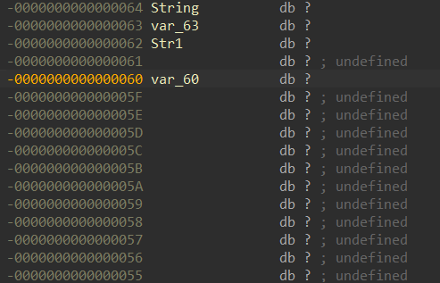

        - String 第五個 byte 後要 "R3versing"
        
    - 第四次檢查 
        
        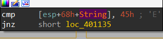
        
        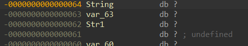

        - String 第一個 byte 要為 45h('E')
    
    - 最後就會根據結果輸出

        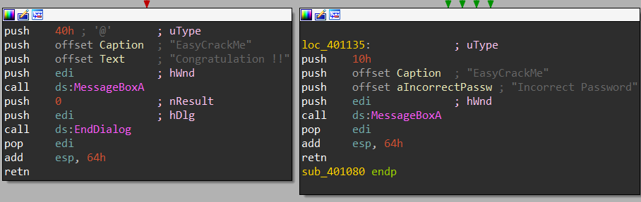
    
- 嘗試動態分析
    - [x64dbg](https://x64dbg.com/)
    - 可以嘗試透過對**每一次檢查**設斷點來驗證是否分析正確 (另一種解法)。

### Flag
```
Ea5yR3versing
```