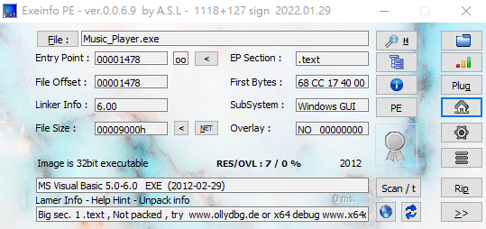
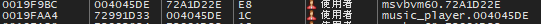
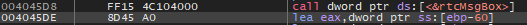
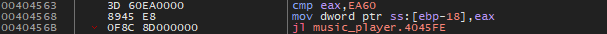
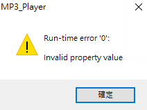
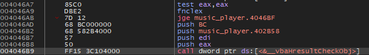

# Music Player

## Information

-  src: [reversing.kr](http://reversing.kr/challenge.php)

## Solution

### 觀察程式資訊



### 分析

- 想辦法使時長超過 1 分鐘，要特別注意可能有其他問題。

- 因為當 player 播放到 1 分鐘時長以後，就會出現一個 MessageBox 裡面是一串不可讀的文字，所以第一步是找到 call 這個 MessageBox 的地方，再想辦法使其延長超過一分鐘。
    - 透過呼叫堆疊中可以發現 music_player 的使用者模組 call 一個其他模組的 function 後，就輸出這個 MessageBox。
    

    - 跟過去會發現是一個名為 `rctMsgBox` 的 function。
    

    - 往前跟會發現前方有一個 cmp 會影響到這裡，而可以發現其中是將某變數與 0XEA60(60000) 比較。
    

    - 將 jl 更改為 jmp，使條件永遠成立，因此執行時長就可以超過一分鐘了。

- 執行過後可以發現出現新的問題。

    

    - 可以透過從前面更改為 jmp 的記憶體位址下斷點跟進去看是哪裡出現這個 MessageBox。
    
    - 透過追蹤會發現是由 0x00404B9 這裡開始走向 Exception error。
    

    - 嘗試更改前面 jg 條件為 jmp 使其永遠跳過該 function。

### Flag

- 以上條件都成立以後，就會發現 flag 出現在一個很特別的地方。

```
LIstenCare
```