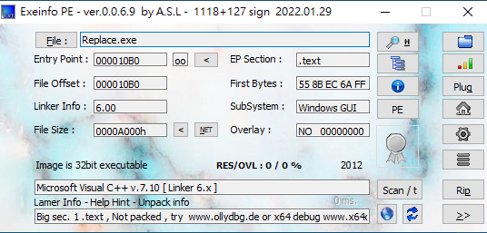
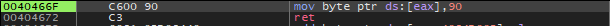

# Replace 

## Information

-  src: [reversing.kr](http://reversing.kr/challenge.php)

## Solution

###  嘗試執行程式

- 經過觀察可以發現要求使用者輸入一段資訊或是密碼等，再根據輸入處理。

### 觀察程式相關資訊



### 分析

- 嘗試靜態分析
    - 利用 IDA 時會發現 `DialogFunc` 中 `sub_40466F`是無法分析的。

- 嘗試動態分析
    - 將斷點設在 0x40105A，觀察獲取輸入後會如何處理。

    - 可以發現輸入後會被儲存在 `replace.004084D0`。

    - 追蹤 `replace.004084D0`，會發現其值會被不斷變動，變動位址與操作如下: 
        - 0x404689: +1
        - 0x404689: +1
        - 0x404674: +0x601605C7
        - 0x404689: +1
        - 0x404689: +1
    
    - 再往下追蹤會發現，其操作最後會將該值放入 `eax`，再將 `byte ptr [eax]` 轉為 0x90 (nop)。
        

    - 為了能成功觸發 `Correct!` 字串位址，但其前面位址 `0x401071` 會一直 jmp。
    

    - 現在將`0x401071`位址轉為 nop
    ，確定可以成功，因此我們將前面 `eax` 轉換為 `0x401071`，這樣就可以使 `0x401071`轉為 nop，再來順利執行到 `Correct!`字串。
        - 要注意溢位問題。
            ```
            >>> 0x00401071 - (1 + 1 + 0x601605C7 + 1 + 1)
            -1607857498
            >>> int(-1607857498+0xffffffff+1)
            2687109798
            ```

### Flag
```
2687109798
```
